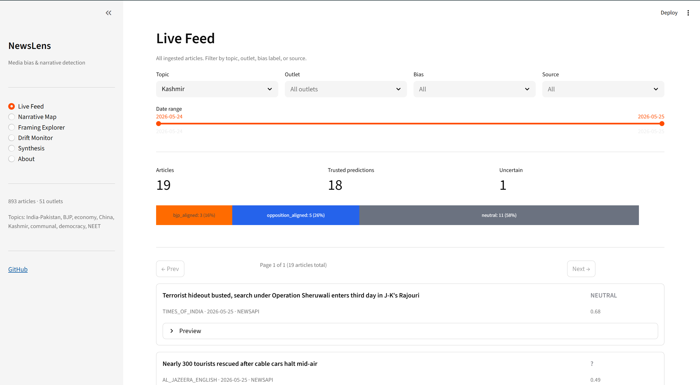
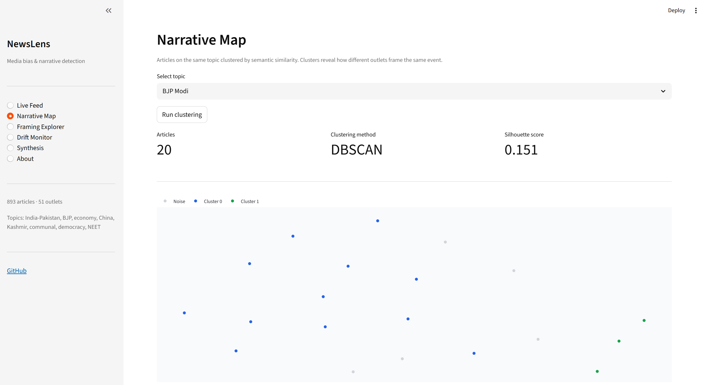
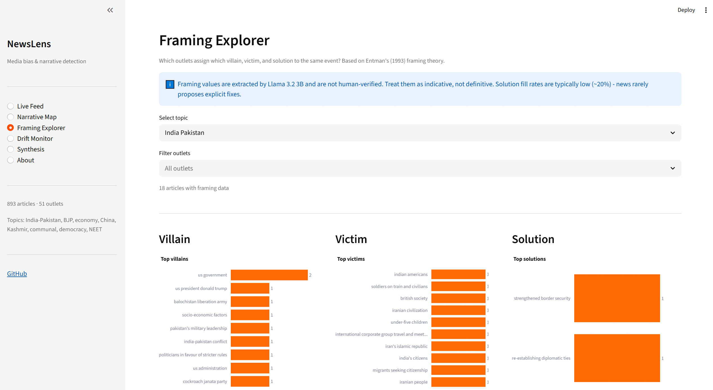
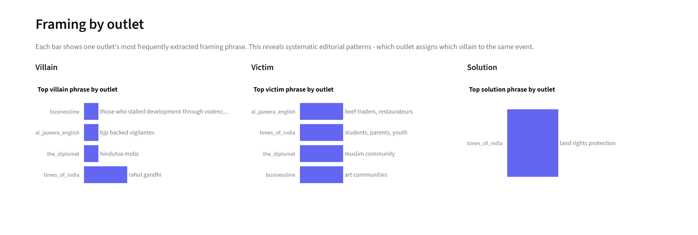
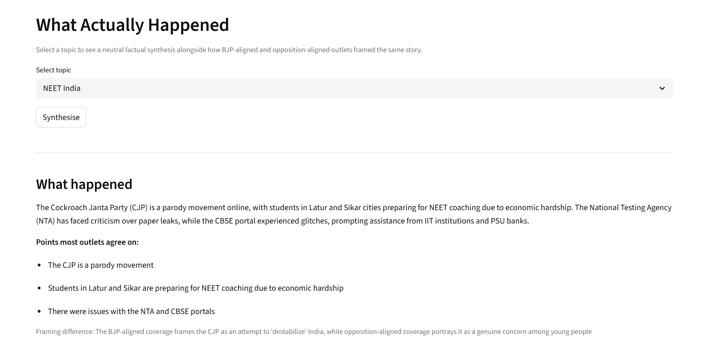
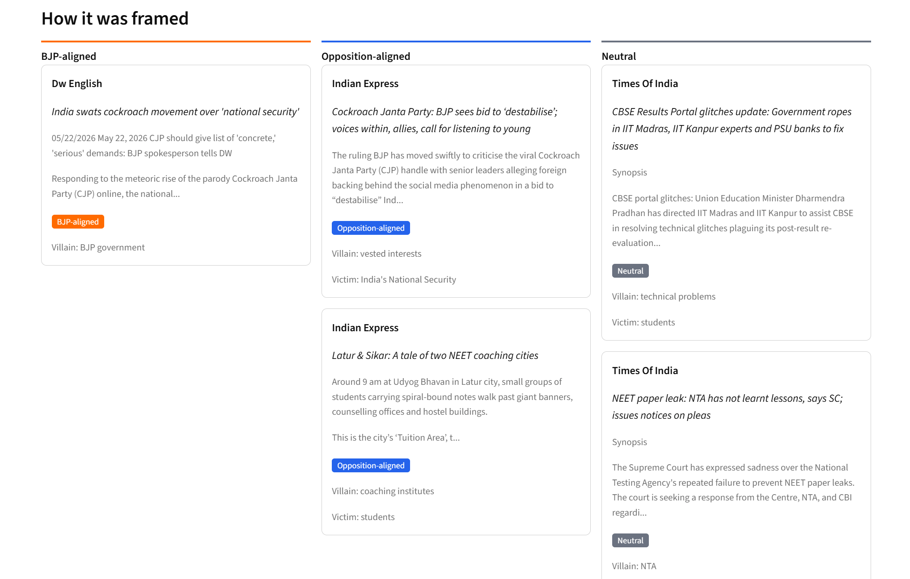
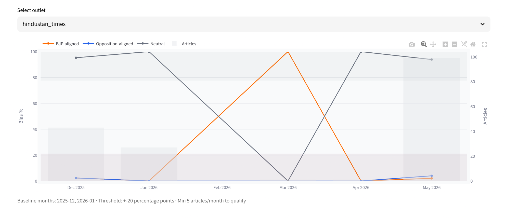

# NewsLens

An end-to-end NLP pipeline that ingests Indian English-language news, classifies political
bias using a fine-tuned RoBERTa model, clusters narratives to reveal how different outlets
frame the same story, and monitors bias drift over time.

The core idea comes from Entman's framing theory (1993): media outlets don't just report
events - they frame them by selecting which aspects to emphasise, who the implied villain and
victim are, and what the implied solution is. NewsLens makes that visible computationally for
Indian news, where ownership concentration and documented editorial alignments make framing
differences unusually large and measurable.

---

## Screenshots

| | |
|---|---|
|  |  |
| *Live Feed - articles with bias labels and distribution bar* | *Narrative Map - UMAP clusters by topic* |
|  |  |
| *Framing Explorer - top villain/victim/solution phrases* | *Framing by outlet - which outlet blames whom* |
|  |  |
| *Synthesis - neutral factual summary* | *Synthesis - BJP-aligned vs opposition framing side by side* |
|  | |
| *Drift Monitor - bias shift over time per outlet* | |

---

## What it does

**1. Bias classification** - Every article is classified as `bjp_aligned`, `opposition_aligned`,
or `neutral` using a fine-tuned RoBERTa-base model. Training labels come from distant
supervision: outlet identity is used as a weak label (Republic TV = bjp_aligned, The Wire =
opposition_aligned, The Hindu = neutral). Predictions below a confidence threshold of 0.85
are flagged as uncertain rather than forced into a label.

**2. Narrative clustering** - Articles on the same topic are grouped by semantic similarity
using sentence embeddings. The clusters reveal how different outlets frame the same event and
which outlets consistently end up in the same narrative group.

**3. Framing extraction** - For each article, a local LLM (Llama 3.2 3B via Ollama) extracts
three dimensions from Entman's framework: the implied villain (causal interpretation), the
implied victim (moral evaluation), and the implied solution (treatment recommendation).
Aggregated across outlets, this surfaces systematic editorial patterns invisible in any single
article.

**4. Synthesis** - For any topic, the pipeline pulls representative articles from each bias
group and calls Ollama to generate a neutral factual summary alongside a note on how the
framing diverged between BJP-aligned and opposition-aligned coverage.

**5. Bias drift monitoring** - Using historical data from the GDELT Project, the pipeline
tracks whether an outlet's political lean has shifted month-over-month. Drift events are
flagged when a label's proportion deviates more than 20 percentage points from the outlet's
baseline.

---

## Results

| Metric | Value |
|--------|-------|
| Total articles ingested | 893 |
| Core Indian outlets covered | Hindustan Times, Times of India, Indian Express, The Hindu, NDTV, Republic World, India Today, News18, Scroll, Business Line, Live Mint |
| Topics analysed | India-Pakistan, BJP/Modi, Indian economy, India-China, Kashmir, communal violence, India democracy, NEET |
| Bias classifier macro F1 | 0.857 (test set) |
| Confidence threshold | 0.85 |
| Trusted predictions | 810 of 893 articles (91%) |
| Articles with framing extracted | 791 |
| Framing parse failures | 0 |
| Drift events detected | 3 |

**Bias distribution across corpus**: neutral 67% · opposition_aligned 28% · bjp_aligned 5%

The heavy neutral skew reflects the outlet composition - centrist mainstream outlets
(Hindustan Times, Times of India) dominate the GDELT historical data and produce the most
articles. BJP-aligned outlets like Republic World have a smaller GDELT footprint.

**Framing fill rates**: villain 94% · victim 96% · solution 24%

Solution is structurally sparse - news rarely proposes explicit fixes.

---

## Tech stack

| Component | Choice | Why |
|-----------|--------|-----|
| Bias classifier | RoBERTa-base (fine-tuned) | Removes the flawed NSP objective from BERT, trained on more data - consistently outperforms DistilBERT on classification tasks with similar inference cost |
| Training data | GDELT-sourced distant supervision | Outlet identity as weak label; GDELT provides months of historical articles per outlet without manual collection |
| Embeddings | `all-MiniLM-L6-v2` (Sentence Transformers) | Fast, 384-dim vectors that capture semantic meaning well for news text; fits comfortably on CPU |
| Clustering | KMeans + DBSCAN fallback | Silhouette score used to choose k; DBSCAN used when no k produces a score above 0.3 |
| Framing + synthesis | Ollama + `llama3.2:3b` | Runs locally (no API cost), fits in 4GB VRAM, produces reliably parseable JSON for structured extraction |
| Vector store | ChromaDB | Purpose-built for embeddings - persistent, no server required, sits alongside SQLite |
| Structured storage | SQLite | Single-user, no setup overhead, full SQL flexibility |
| Historical data | GDELT Project | Free, open, global news archive - provides months of historical Indian outlet data for drift monitoring |
| Ingestion | NewsAPI + RSS + newspaper3k | NewsAPI for topic search, RSS for continuous outlet coverage, newspaper3k for full-text scraping |
| Dashboard | Streamlit | Appropriate tool for an ML pipeline demo - fast to build, easy to share |

---

## Project structure

```
news-lens/
├── src/
│   ├── ingestion.py            # NewsAPI + RSS fetching and deduplication
│   ├── scraper.py              # newspaper3k full-text scraping
│   ├── db.py                   # SQLite schema, insert, and query functions
│   ├── chroma_store.py         # ChromaDB vector storage and retrieval
│   ├── preprocess.py           # Text cleaning and outlet name normalisation
│   ├── classifier.py           # Fine-tuned bias classifier - load and predict
│   ├── classify_articles.py    # Run classifier over all unclassified articles
│   ├── embeddings.py           # Sentence embedding generation
│   ├── clustering.py           # Narrative clustering and evaluation
│   ├── framing.py              # Ollama framing extraction with JSON validation
│   ├── drift.py                # Bias drift calculation and monthly aggregation
│   ├── collect_training_data.py # GDELT training data collection
│   └── gdelt_pull.py           # GDELT historical data pull for drift monitoring
├── training/
│   └── fine_tune.py            # RoBERTa fine-tuning script (8 epochs, macro F1 optimised)
├── notebooks/
│   ├── 01_ingestion_validation.ipynb
│   ├── 02_classifier_eval.ipynb
│   ├── 03_narrative_clustering.ipynb
│   ├── 04_framing_extraction.ipynb
│   └── 05_drift_monitoring.ipynb
├── app/
│   ├── main.py                 # Streamlit entry point and navigation
│   └── views/
│       ├── live_feed.py        # Article browser with filters and pagination
│       ├── narrative_map.py    # UMAP scatter + cluster breakdown
│       ├── framing_explorer.py # Villain/victim/solution charts by outlet
│       ├── drift_monitor.py    # Bias drift time series
│       ├── synthesis.py        # "What Actually Happened" - Ollama synthesis
│       └── about.py            # Methodology and limitations
├── data/
│   ├── newslens.db             # SQLite database (893 articles)
│   ├── chroma_store/           # ChromaDB embeddings
│   ├── india_training/         # GDELT training data CSVs
│   └── gdelt/                  # GDELT historical data for drift
└── models/
    └── bias_classifier/        # Saved RoBERTa checkpoint
```

---

## Quick start

The SQLite database and ChromaDB store are included in the repo, so the dashboard works
immediately without running the pipeline.

**Prerequisites**: Python 3.11, [Ollama](https://ollama.com) installed (for the Synthesis page only)

```bash
git clone https://github.com/skanda-2003/news-lens.git
cd news-lens
python -m venv venv
source venv/bin/activate
pip install -r requirements.txt

# For the Synthesis page - pull the local LLM
ollama pull llama3.2:3b
sudo systemctl start ollama

streamlit run app/main.py
```

A free NewsAPI key is needed only if re-running ingestion. Get one at [newsapi.org](https://newsapi.org),
then add `NEWSAPI_KEY=your_key_here` to a `.env` file in the project root.

---

## Running the full pipeline

Each step reads from and writes to the same SQLite database, so they can be run
independently. The saved model checkpoint is included - skip step 2 to use it directly.

```bash
# 1. Collect training data from GDELT (Indian outlets, distant supervision labels)
python src/collect_training_data.py

# 2. Fine-tune the bias classifier (skip to use the included checkpoint)
python training/fine_tune.py

# 3. Ingest live articles
python src/ingestion.py

# 4. Generate embeddings and classify bias
python src/embeddings.py
python src/classify_articles.py

# 5. Extract framing (Ollama must be running)
python src/framing.py

# 6. Pull GDELT historical data for drift monitoring
python src/gdelt_pull.py

# 7. Launch the dashboard
streamlit run app/main.py
```

---

## Known limitations

**Distant supervision labels are outlet-level, not article-level.** A single article from
Republic TV may be perfectly balanced; the model still sees it as bjp_aligned at training
time. This is a known trade-off of the approach - the alternative (manual annotation at scale)
was out of scope. Outlet leanings are based on Reporters Without Borders assessments and
documented ownership records, not my own judgement.

**English-only classifier.** The model was trained on English Indian news and does not
generalise to Hindi, Tamil, Marathi, or other regional language outlets. Outlets like Aaj Tak
and Dainik Bhaskar are excluded for this reason. English Indian news skews toward urban,
educated readership - the corpus is not representative of the full Indian media landscape.

**Topic contamination in RSS feeds.** RSS feeds are not topic-filtered, so the India-Pakistan
query can pull in cricket coverage from a political outlet. This carries through to framing
and clustering.

**Framing extraction is LLM-generated and unverified at scale.** The villain/victim/solution
outputs from Llama 3.2 3B are model interpretations, not ground truth. No human validation
was performed. Phrase fragmentation is a known issue - "Pakistan", "Pakistani government",
and "Pakistan-backed militants" are counted as separate villain phrases.

**GDELT data is sparse for Indian outlets.** Most outlets average 2-10 articles per month in
GDELT. Weekly rolling averages are meaningless at this density, so monthly aggregation is
used instead. Drift events should be read as directional signals, not statistically rigorous
findings.

---

## References

Entman, R. M. (1993). Framing: Toward clarification of a fractured paradigm. *Journal of
Communication*, 43(4), 51-58.

Haak, B., & Schaer, P. (2023). Automated news framing detection.

Reporters Without Borders. (2024). *India - RSF Press Freedom Index*.
rsf.org/en/country/india